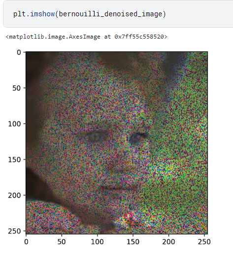
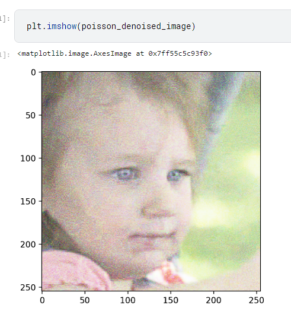

# Age and Gender Detection from Images

## Overview

This project aims to detect the age and gender of individuals from images using computer vision techniques. As part of the preprocessing pipeline, a denoising step is applied to improve the quality of input images. In this project, the BM3D (Block-Matching 3D Filtering) algorithm is employed for denoising face images.

## Motivation

Accurate age and gender detection from images is valuable for various applications, including demographic analysis, targeted advertising, and personalized services. However, image quality can significantly affect the performance of detection algorithms. By applying denoising techniques such as BM3D, we can enhance image quality and improve the accuracy of subsequent age and gender detection.

## Denoising with BM3D

The `Denoising` folder contains the implementation of the BM3D algorithm for denoising face images. This step is crucial for preprocessing input images before feeding them into the age and gender detection models.
### Introduction:

BM3D stands as a pioneering image denoising algorithm introduced by Dabov et al. in 2007. It represents a notable advancement in the field of image processing, offering superior denoising capabilities compared to traditional methods. The essence of BM3D lies in its adeptness at leveraging inherent redundancy within natural images to effectively remove noise while meticulously preserving fine image details. This sophisticated approach combines principles of block matching, collaborative filtering, and transform domain processing to achieve remarkable denoising results.

### Key Concepts:

At the core of the BM3D algorithm lies a meticulous process of block matching, wherein the image is meticulously divided into overlapping blocks. These blocks are then subjected to an exhaustive search process within a specified window to identify similar patterns across the image. The subsequent collaborative filtering phase capitalizes on these identified similar blocks, employing joint processing to meticulously estimate the clean signal. This collaborative endeavor effectively harnesses the inherent redundancy within image content, contributing significantly to the denoising efficacy of BM3D.

### Transform Domain Processing:

BM3D operates with finesse in the transform domain, a realm where image patches undergo transformation using established techniques such as the Discrete Cosine Transform (DCT). This transformational approach bestows several advantages upon the algorithm, including enhanced discrimination between signal and noise components and streamlined computational complexity. By operating within this domain, BM3D adeptly navigates the denoising process, delicately removing noise while adeptly preserving intricate image structures and nuanced details.

### Thresholding and Inverse Transform:

Following collaborative filtering, BM3D meticulously applies thresholding to the transformed coefficients, strategically eliminating noise components while preserving vital image details. This thresholding operation is marked by its adaptability, wherein thresholds are tailored to the estimated noise levels of individual blocks. Such adaptive thresholding ensures the effective suppression of noise without compromising the integrity of image features. Subsequently, denoised coefficients undergo an inverse transformation, culminating in the production of a denoised image ready for further analysis or application.

### Advantages and Limitations:

BM3D boasts a plethora of advantages, including its superior denoising performance, meticulous preservation of image details, and adaptability to diverse noise levels. However, it is worth noting that the algorithm may incur significant computational overhead, particularly in scenarios involving large images or heightened noise levels. Furthermore, BM3D's efficacy may be diminished in instances where noise characteristics deviate notably from the assumed model of additive white Gaussian noise (AWGN). Nonetheless, BM3D remains an esteemed and widely employed denoising solution across various disciplines, seamlessly striking a balance between noise reduction and detail preservation.

### Applications:

The versatile applicability of BM3D extends across diverse domains, encompassing realms such as digital photography, video processing, medical imaging, and surveillance. Notably, BM3D finds particularly profound utility in contexts where the meticulous preservation of image details holds paramount significance, such as medical diagnosis or forensic analysis. The algorithm's efficacy and versatility render it an invaluable asset to researchers and practitioners within the realms of image processing and computer vision, perpetuating its status as a cornerstone denoising methodology.

## Denoising with Autoencoder

In addition to the BM3D algorithm, we explored the utilization of an autoencoder network for denoising face images. Autoencoder networks have shown promising results in image denoising tasks by learning efficient representations of clean image patches. However, due to computational limitations and resource constraints, we were unable to complete the experimentation phase and obtain conclusive results with the autoencoder-based approach.

While the autoencoder network offers potential advantages such as end-to-end learning and adaptability to different noise levels, further investigation and optimization are required to leverage its capabilities effectively. Future iterations of this project may involve revisiting the autoencoder-based denoising approach with improved computational resources and algorithmic enhancements.

## Usage

### Dependencies

- Python 3.x
- NumPy
- OpenCV
- bm3d

### Running the Denoising Algorithm

To denoise face images using BM3D, follow these steps:

1. Place your face images in the `denoising/input_images` directory.
2. Run the `denoising/bm3d_denoise.ipynb` 

## Results

Here are some examples of face images before and after applying BM3D denoising:
BM3d has a PSNR of 23.57

 

## Contributing

Contributions are welcome! If you find any bugs or have suggestions for improvement, please open an issue or submit a pull request.

## License

This project is licensed under the MIT License - see the [LICENSE](LICENSE) file for details.

